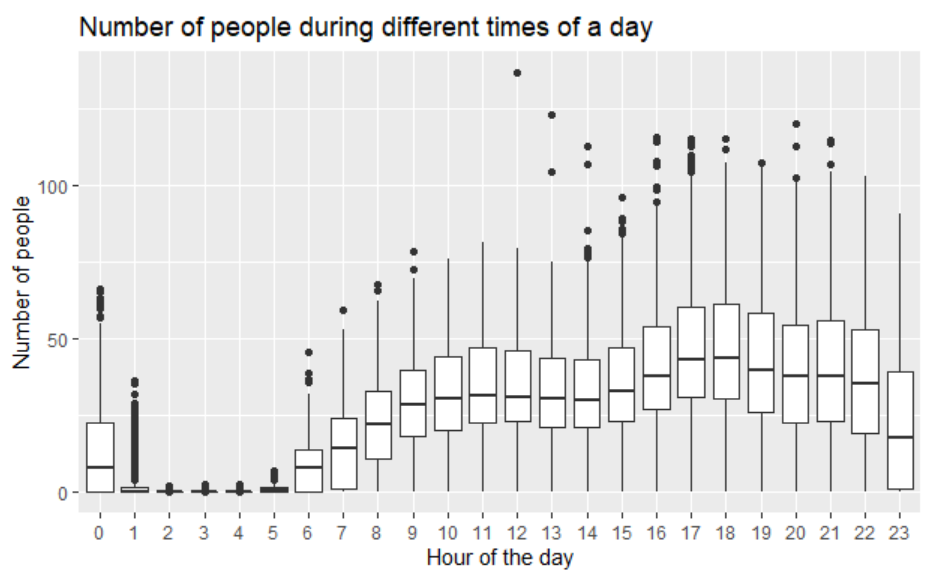
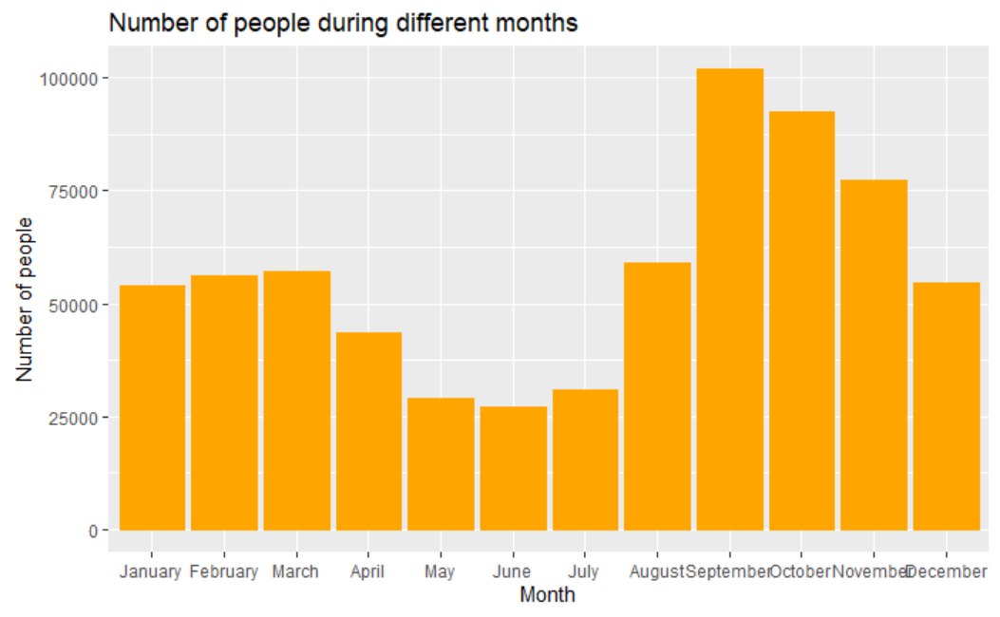
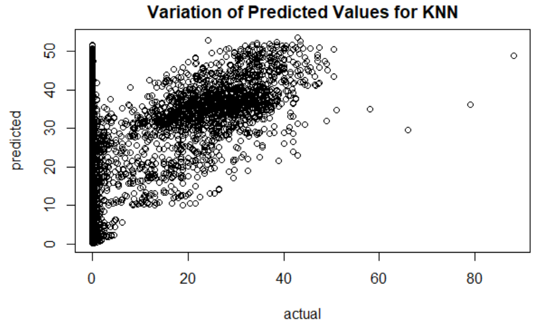

# Gym Crowdedness Analysis (Summer 2019)
Trying to predict crowdedness at a the UC Berkley gym, and running different regressions on the project. This was a group project for the Predictive Modeling course in my Business Analytics masters program at UT Austin.

# Dataset
Data collected every 10 minutes for 2 years at UC-Berkeley’s campus gym
62,000+ observations
Variables: Number of people, Date, Timestamp, Day of week, Is it the weekend? (1/0), Is it a holiday? (1/0), Outside temperature, Is it the start of the semester? (1/0), Is it during the semester? (1/0), Month, Hour

# EDA
As part of analyzing the data, we plotted different predictors against the target variable, i.e the number of people and tried to see if any patterns emerge. Two such plots are worth looking into.

First one is the the plot between hour of the day vs avg. number of people at gym. We can see that the number people going to the gym are low from 12 midnight till early morning 6 am. The number increases as the day progresses and then starts to decline after 10 pm.

The 2nd plot the average no of people at gym in a given month. As expected, the number is low during summer break and high at the start of fall semester.

# Multiple Linear Regression
Obtaining best subset (6 predictors):

Running regression and obtaining RMSE:

MLR obtained an RMSE of 1.71. That’s really good but unfortunately MLR does not provide accurate response values. Since it has bounds of (-inf,inf), it is predicting negative response values which does not make sense with our data. 

# Negative Binomial Regression
We account for MLR predicting negative response values by performing NB regression on the best subset. 

We obtained an RMSE of 4.9 but it is still fairly low and the model predicts accurate response values.

# KNN
Next we ran a KNN model on the dataset for n=10, 50, 100, 500 and 1000.

RMSE values of for models ranged from 22 to 26.
KNN failed to model the dataset accurately and performed worse than a linear regression model.

# Additional Models
We also ran decision tree and random forest to see if we could more obtain a more accurate prediction.
## Decision Tree
First we cross validated and found that 42 was the optimal number of nodes to have for out tree.

 

This model produced a test RMSE of 12.10. This tree is slightly less complex than the original tree but is still difficult to interpret and does not have the predictive power that we have seen with some of the other models.

## Random Forest
Our random forest contained 1000 trees, with the hopes of being more stable and accurate compared to our decision tree.
To begin, we performed feature importance to see which variables were most significant.

 
 
 We found that our 1 Day Lag, 1 Week Lag, and Hour of Day variables were most important, and ran our random forest with these variables.

 

Unfortunately, our model tends to overestimate the actual number of gym goers and makes high predictions even when no one is at the gym. 

# Final Recommendation

Our final recommendation is to use the negative binomial best subset model to predict what days to go to the gym. With this model, students will be able to see when the gym is least busy, the gym will know how many employees to have on hand, and they can also schedule workout classes appropriately.
